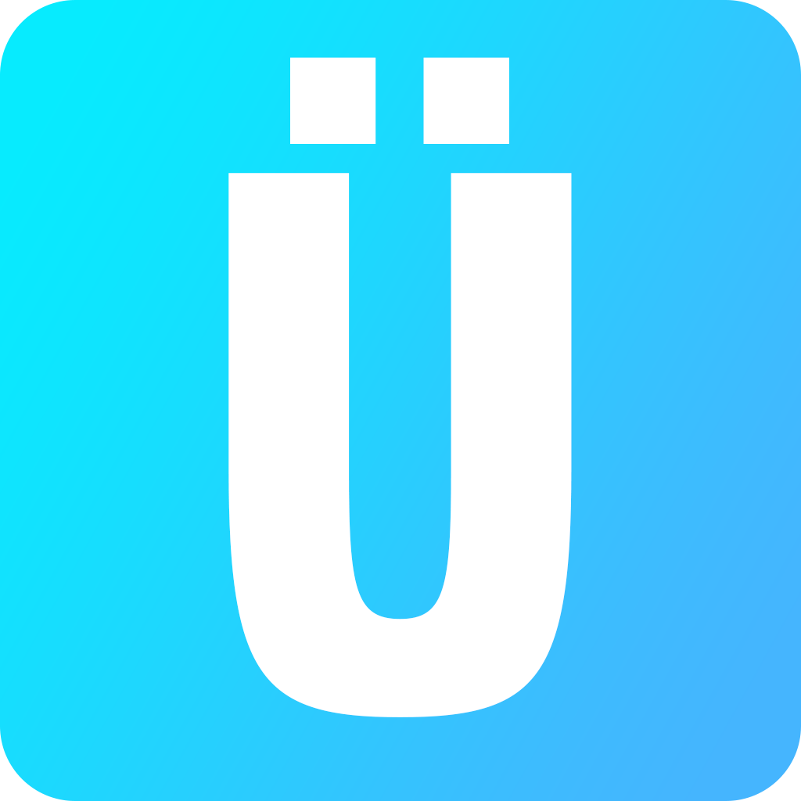

<h1 align="center">
  <br>
  Ü Toolbox
</h1>
<p align="center">
    
  <a href="https://github.com/obteknoloji/u-toolbox/releases/latest">
    
  </a>
  
</p>
<br>

**Ü Toolbox**, Windows 11 deneyiminizi iyileştirmek, gizliliğinizi artırmak ve sistem performansını maksimize etmek için özel olarak tasarlanmış **açık kaynaklı** bir araç setidir. Ağır sistem programlarına ihtiyaç duymadan, modern bir arayüz ile bilgisayarınızın kontrolünü tamamen elinize alın.


## Öne Çıkan Özellikler
- **Derinlemesine Temizlik:** Temp, Prefetch, Windows Update artıkları, Minidump ve önbellek dosyalarını güvenle temizleyerek disk alanı açın. Temizlik geçmişinizi saklayın.
- **RAM Optimizasyonu:** Arka planda bekleyen ve askıda kalan uygulamaların bellekteki (Working Set) yerini zorla boşaltarak sistemi rahatlatın.
- **Gelişmiş Windows Özelleştirici:** Ağ darboğazını (Network Throttling) kaldırma, Nagle algoritmasını kapatıp ping düşürme, işlemci mikro uykularını iptal etme (Ultimate Performance) vb. gizli Windows 11 ayarlarına tek tıkla erişin.
- **Dosya Öğütücü:** İçine rastgele veri yazarak (DoD 3-pass wipe) dosyaları diskten kalıcı olarak, bir daha asla geri getirilemeyecek şekilde yok edin.
- **Kapanış Planlayıcı:** Bilgisayarınızı geri sayım sayacıyla veya belirli bir saatte otomatik olarak kapanmaya programlayın.
- **Kullanım Geçmişi:** Bilgisayarınızı hangi gün ve hangi saat aralıklarında ne kadar süreyle kullandığınızı detaylı olarak görüntüleyin.
- **Masaüstü Düzen Yöneticisi:** Kusursuz dizdiğiniz masaüstü simgelerinin konumlarını kaydetme ve Windows kafasına göre karıştırdığında tek tıkla eski haline (ışınlayarak) geri getirin.
- **Klasör Sıkıştırıcı:** Oyun veya program dosyalarını performans kaybı yaşatmadan Windows'un yerel Compact algoritmasıyla küçültüp gigabaytlarca yer açın.
- **Sistem Geri Yükleme:** Herhangi bir kritik ayar öncesi Windows'un sağlıklı anının güvenli yedeğini tek tıkla oluşturun.
- **Çoklu Dil ve Tema Desteği:** Akıcı bir şekilde çalışan İngilizce/Türkçe dil seçenekleri ile modern Karanlık (Dark) ve Aydınlık (Light) tema geçişleri.
---
## Geliştirme ve Kurulum
Projeyi kendi bilgisayarınızda çalıştırmak veya geliştirmeye katkıda bulunmak için aşağıdaki adımları izleyin.
### Gereksinimler
- [Node.js](https://nodejs.org/) (Sürüm 18+ önerilir)
- Windows 11 İşletim Sistemi.
### 1. Klonlama ve Yükleme
```bash
# Repoyu bilgisayarınıza indirin
git clone https://github.com/obteknoloji/u-toolbox.git
# Proje klasörüne girin
cd u-toolbox
# Gerekli kütüphaneleri yükleyin
npm install
```

## 2. Geliştirici Modunda Başlatma
Koddaki değişiklikleri anında görebilmek (Hot-reload) için geliştirici modunda şu komutla çalıştırın:
```bash
npm run electron:dev
```
## Paketleme ve Derleme (.exe oluşturma)
Projeyi düzenledikten sonra kendiniz veya son kullanıcılar için yüklenebilir/çalıştırılabilir bir .exe dosyası oluşturmak istiyorsanız:
```bash
npm run electron:build
```
Bu işlem tamamlandığında proje klasörünün içindeki release klasöründe uygulamanızın çalıştırılabilir yükleme dosyası bulunacaktır.

## Kullanılan Teknolojiler
- Electron.js: Masaüstü entegrasyonu ve çekirdek yapısı.
- Vite: Hızlı frontend derleyicisi ve HMR.
- Vanilla JS & CSS3: Saf ve yüksek performanslı, framework-bağımsız ön yüz donanımı.
- Koffi(FFI): Windows'un kalbine C/C++ hızında doğrudan erişim sağlayan ultra hızlı Foreign Function Interface kütüphanesi
- Windows Native APIs: Kernel32.dll, Ntdll.dll, Advapi32.dll, Psapi.dll

## Katkıda Bulunma
Bu proje topluluğa açıktır! Herhangi bir eksiği tamamlayabilir, hata bildirebilir (Issues) veya yeni bir özellik ekleyip çekme isteği (Pull Request) gönderebilirsiniz. Yeni ince ayarlar ve araçlar eklemek için her zaman açığız.
